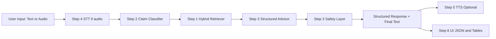

# Veridiction: Indian Legal Aid Assistant (GenAI Prototype)

Veridiction is an end-to-end legal aid assistant prototype designed for laypersons in India, with Maharashtra-focused procedural grounding.

It accepts text or voice input, detects likely legal issue type and urgency, retrieves relevant legal material, generates structured guidance, adds safety escalation signals, and can speak the output back to the user.

## Objective

The primary objective is practical legal triage for non-experts:

1. Help users describe legal problems in plain language.
2. Convert vague narratives into structured legal next steps.
3. Surface emergency-aware guidance when risk indicators are present.
4. Keep outputs explainable with retrieved passages and deterministic fallbacks.
5. Make the workflow accessible through voice and UI interfaces.

This project is for research and prototyping, not legal representation.

## End-to-End Capabilities

1. Hybrid retrieval (dense + lexical reranking + query rewrites) over Indian legal datasets.
2. Claim classification with urgency and intent labels.
3. LangGraph orchestration: Retriever -> Advisor -> Safety.
4. Speech-to-text from file, fixed mic recording, or live mic capture.
5. Text-to-speech response generation with online + offline fallback.
6. Interactive Gradio and Streamlit apps for full workflow testing.

## Architecture



## Methodology by Step

### Step 1: Retrieval

Implementation: [rag/retriever.py](rag/retriever.py)

Core strategy:

1. Build local vector index with LlamaIndex and Hugging Face embeddings.
2. Route between judgment-heavy retrieval and procedural retrieval.
3. Expand query variants using intent-aware rewrites.
4. Re-rank with phrase boosts, TF-IDF-like keyword weighting, and legal synonym boosts.
5. Merge and calibrate top-k results with metadata for traceability.

Notable behavior:

1. Pulls broad candidate sets, then reranks aggressively.
2. Uses procedural fallback when substantive retrieval confidence is low.
3. Preserves source metadata and retrieval route in output.

### Step 2: Classification and Urgency

Implementation: [nlp/classifier.py](nlp/classifier.py)

Core strategy:

1. Rule-based keyword scoring for deterministic signal.
2. Semantic similarity scoring using sentence-transformers embeddings.
3. Weighted fusion:
   1. Embedding weight: 0.65
   2. Keyword weight: 0.35
4. Urgency estimation from lexical risk patterns and claim context.
5. Intent scoring for procedural, evidence, forum, timeline, and relief cues.

Supported claim types:

1. unpaid_wages
2. domestic_violence
3. property_dispute
4. wrongful_termination
5. police_harassment
6. tenant_rights
7. consumer_fraud
8. other

### Step 3: Orchestration, Structured Advice, and Safety

Implementation: [agents/langgraph_flow.py](agents/langgraph_flow.py)

Graph pipeline:

1. Retriever node: classification + top-k retrieval.
2. Advisor node: structured legal response generation.
3. Safety node: risk flags, escalation suggestions, mandatory disclaimer.

Advisor generation policy:

1. Primary: Grok chat-completions client when API credentials are available.
2. Fallback: deterministic structured template based on classification + retrieved passages + knowledge mappings.
3. Grounding-aware behavior: low-context mode when retrieval confidence is weak.

Safety policy:

1. Detect immediate danger and other high-risk contexts.
2. Upgrade severity metadata where needed.
3. Always include mandatory legal disclaimer.

### Step 4: Speech-to-Text

Implementation: [audio/transcriber.py](audio/transcriber.py)

Core strategy:

1. Uses faster-whisper with distil-large-v3 defaults.
2. Supports file transcription, fixed-duration recording, and live mic mode.
3. Live mode supports stop by Enter key, silence threshold, or max duration.
4. Supports local model caching and local-files-only operation after warmup.

### Step 5: Text-to-Speech

Implementation: [tts/speak.py](tts/speak.py)

Core strategy:

1. Primary engine: edge-tts (high-quality network synthesis).
2. Fallback engine: pyttsx3 (offline local synthesis).
3. Safe text normalization before synthesis:
   1. remove markdown and code fences
   2. remove control characters
   3. collapse whitespace
   4. clamp length
4. Returns structured audio artifact metadata.

### Step 6: User Interfaces

Implementations:

1. [app_gradio.py](app_gradio.py)
2. [app_streamlit.py](app_streamlit.py)

UI behavior:

1. Accept text or audio input.
2. Run STT (when needed).
3. Execute end-to-end legal graph.
4. Optionally synthesize TTS output.
5. Show structured sections, safety JSON, retrieval table, and final text.

## Models and External Services

1. Embeddings: sentence-transformers/all-MiniLM-L6-v2
2. STT: faster-whisper distil-large-v3 (HF alias: Systran/faster-distil-whisper-large-v3)
3. Advisor LLM: Grok API (optional, enabled via env vars)
4. Deterministic advisor fallback: always available without API keys
5. TTS engines: edge-tts (primary), pyttsx3 (fallback)

## Datasets and Knowledge

Retrieval datasets (configured in Step 1):

1. vihaannnn/Indian-Supreme-Court-Judgements-Chunked
2. Subimal10/indian-legal-data-cleaned
3. viber1/indian-law-dataset
4. ShreyasP123/Legal-Dataset-for-india
5. nisaar/Lawyer_GPT_India

Knowledge mapping:

1. [data/legal_knowledge/maharashtra_legal_knowledge.json](data/legal_knowledge/maharashtra_legal_knowledge.json)
2. Loaded by [legal/knowledge_base.py](legal/knowledge_base.py)

## Tech Stack

1. Python 3.11
2. PyTorch
3. sentence-transformers
4. transformers
5. llama-index-core
6. llama-index-embeddings-huggingface
7. datasets
8. langgraph
9. pydantic
10. faster-whisper
11. sounddevice
12. numpy
13. edge-tts
14. pyttsx3
15. gradio
16. streamlit

## Project Structure

Core modules:

1. [rag/retriever.py](rag/retriever.py)
2. [nlp/classifier.py](nlp/classifier.py)
3. [agents/langgraph_flow.py](agents/langgraph_flow.py)
4. [audio/transcriber.py](audio/transcriber.py)
5. [tts/speak.py](tts/speak.py)
6. [legal/knowledge_base.py](legal/knowledge_base.py)

Apps:

1. [app_gradio.py](app_gradio.py)
2. [app_streamlit.py](app_streamlit.py)

Validation:

1. [rag/validate_retriever_advanced.py](rag/validate_retriever_advanced.py)
2. [audio/validate_step4_audio.py](audio/validate_step4_audio.py)
3. [VALIDATION_QUERIES.py](VALIDATION_QUERIES.py)
4. [Documentation/VALIDATION.md](Documentation/VALIDATION.md)

## Environment and Configuration Principles

This project is intentionally modular. You can run it in any Python 3.11 environment (venv, conda, poetry, uv) as long as dependencies are installed and the same interpreter is used consistently for all commands.

Recommended environment strategy:

1. Create an isolated Python environment for reproducibility.
2. Keep ML/audio/UI dependencies installed in the same environment.
3. Reuse cached model artifacts under the data folder to avoid repeated downloads.
4. Treat cloud services (Grok, edge-tts) as optional accelerators, not hard dependencies.
5. Ensure deterministic fallback paths stay available for offline or API-failure scenarios.

Suggested dependency groups:

1. Core NLP and retrieval: torch, sentence-transformers, transformers, llama-index-core, llama-index-embeddings-huggingface, datasets.
2. Orchestration and schema: langgraph, pydantic.
3. Audio: faster-whisper, sounddevice, numpy.
4. TTS and UI: edge-tts, pyttsx3, gradio, streamlit.

Portable dependency installation:

```bash
python -m pip install torch sentence-transformers transformers
python -m pip install llama-index-core llama-index-embeddings-huggingface datasets
python -m pip install langgraph pydantic
python -m pip install faster-whisper sounddevice numpy
python -m pip install edge-tts pyttsx3 gradio streamlit
```

Optional Grok configuration:

Create a .env file in repository root if you want LLM-backed structured advisor responses:

```env
GROK_API_KEY=your_api_key_here
GROK_BASE_URL=https://api.x.ai/v1
GROK_MODEL=grok-2-latest
```

If not set, the system automatically uses deterministic fallback advisor logic.

## Run Guide

### A) Step 4 warmup (download STT model once)

```bash
python audio/transcriber.py --download-only --model-name distil-large-v3 --model-dir data/models/faster-whisper
```

### B) Step 4 live mic transcription

```bash
python audio/transcriber.py --live-mic --local-files-only --model-dir data/models/faster-whisper --record-out data/audio_live.wav --max-seconds 30 --silence-seconds 2.0 --language en
```

### C) End-to-end flow (text)

```bash
python agents/langgraph_flow.py --query "My employer has not paid my salary for 3 months" --top-k 5 --advisor-provider auto
```

### D) End-to-end flow (live mic + STT local cache)

```bash
python agents/langgraph_flow.py --live-mic --audio-model-dir data/models/faster-whisper --audio-local-files-only --record-out data/audio_live.wav --audio-max-seconds 30 --audio-silence-seconds 2.0 --audio-language en --top-k 5 --advisor-provider auto
```

### E) End-to-end flow (live mic + TTS output)

```bash
python agents/langgraph_flow.py --live-mic --audio-model-dir data/models/faster-whisper --audio-local-files-only --record-out data/audio_live.wav --audio-max-seconds 30 --audio-silence-seconds 2.0 --audio-language en --top-k 5 --advisor-provider auto --enable-tts --tts-output data/tts/final_response.mp3 --tts-engine edge_tts --tts-fallback-engine pyttsx3
```

### F) Standalone Step 5 TTS

```bash
python tts/speak.py --text "Your complaint appears to be unpaid wages. Please gather salary slips and file a written complaint." --output data/tts/sample_response.mp3 --engine edge_tts --fallback-engine pyttsx3
```

### G) Launch Gradio UI

```bash
python app_gradio.py
```

Gradio opens on the first available localhost port, typically starting at http://127.0.0.1:7860.

### H) Launch Streamlit UI

```bash
python -m streamlit run app_streamlit.py
```

## Validation

### Retriever quality validation

```bash
python rag/validate_retriever_advanced.py --force-rebuild
```

### Step 4 audio + pipeline validation

```bash
python audio/validate_step4_audio.py --audio-file data/sample.wav --local-files-only --report-out data/step4_validation_report.json
```

### Manual scenario testing

Use [VALIDATION_QUERIES.py](VALIDATION_QUERIES.py) to run coverage across claim types, edge cases, and performance scenarios.

## Safety, Scope, and Limitations

1. Outputs are triage guidance, not legal advice.
2. System currently focuses on English-language interactions.
3. Procedural mapping is Maharashtra-oriented by default.
4. Retrieval confidence can vary with sparse or ambiguous user input.
5. For emergencies, users should prioritize immediate official support services.

## Suggested Production Path

For multi-user deployment and sync across clients:

1. Move orchestration to a single backend API.
2. Store transcripts, structured outputs, and audio artifacts in shared persistence.
3. Use stable session IDs and artifact URLs.
4. Add auth, audit logs, and role-based access.
5. Add websocket or polling-based cross-client synchronization.

## Troubleshooting

1. If STT model load fails on first run, rerun warmup and allow full download completion.
2. If Grok output is unavailable, verify .env credentials; fallback mode should still work.
3. If mic capture is empty, check OS microphone permissions and input device selection.
4. If TTS edge engine fails, pyttsx3 fallback should generate local WAV output.
5. If module imports fail, verify that python and pip both point to the same active environment.

## Disclaimer

This project is an AI research prototype and not a substitute for professional legal advice. Always consult a qualified lawyer for legal decisions.